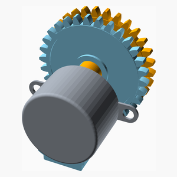
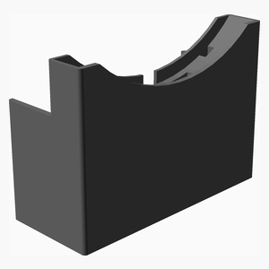
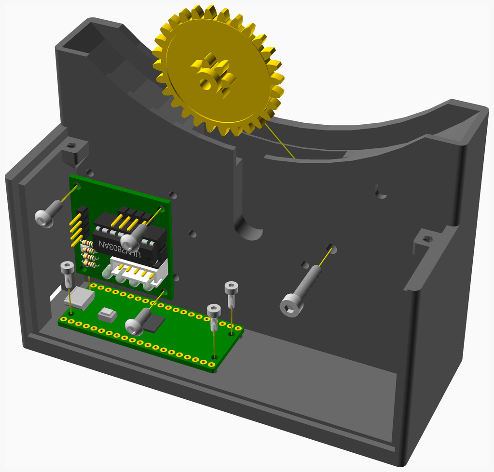
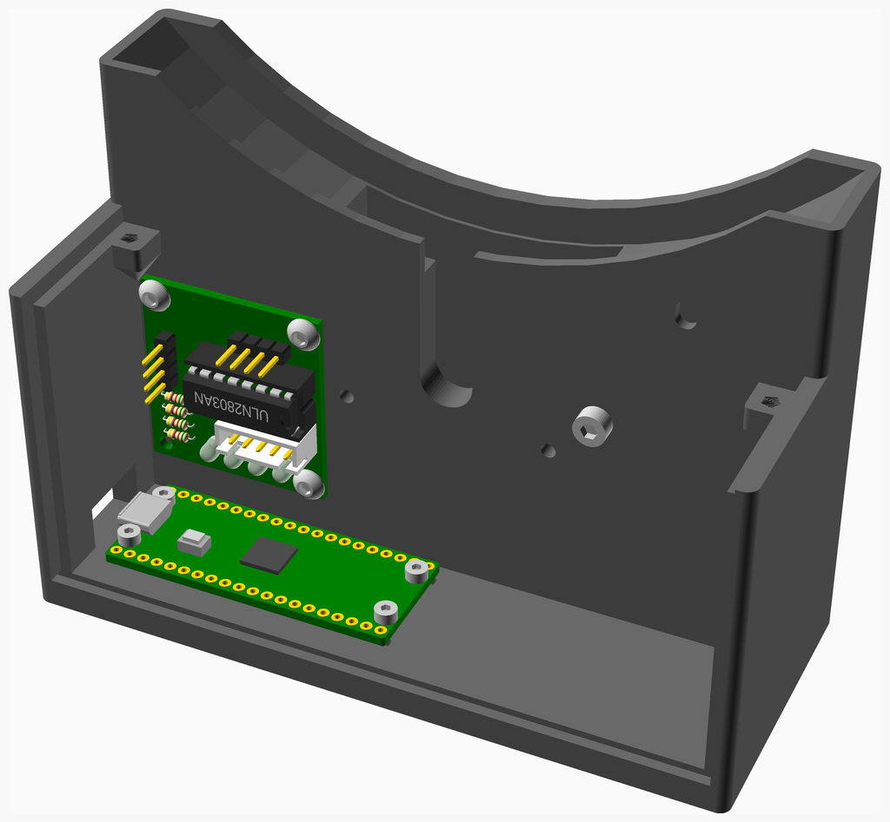
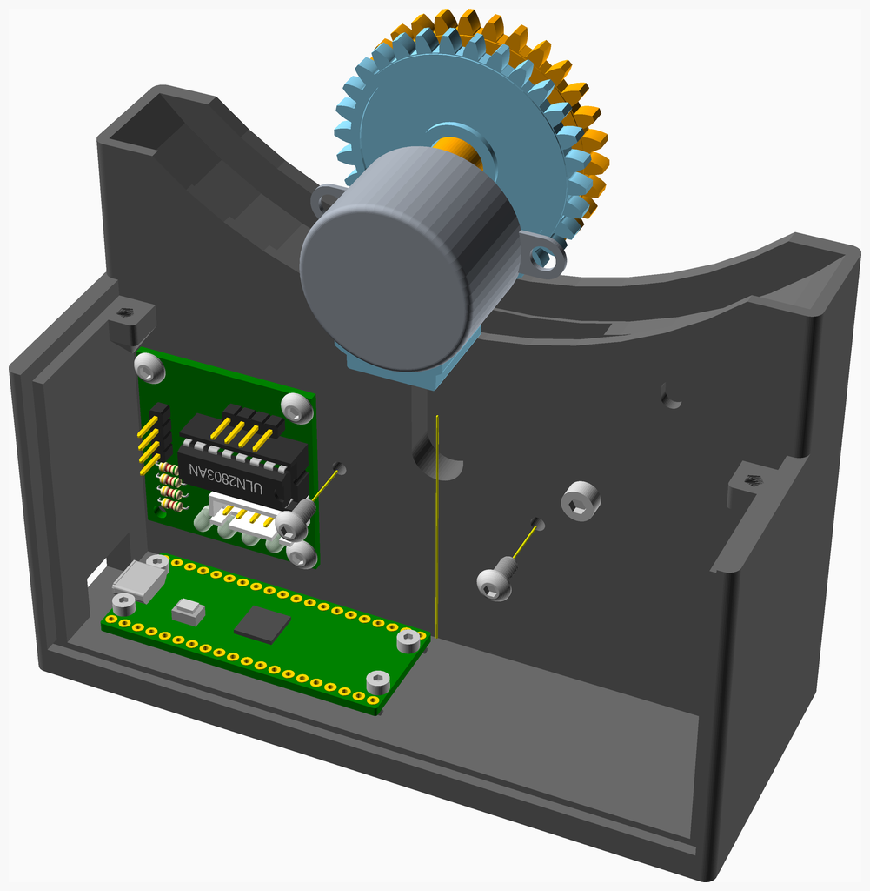
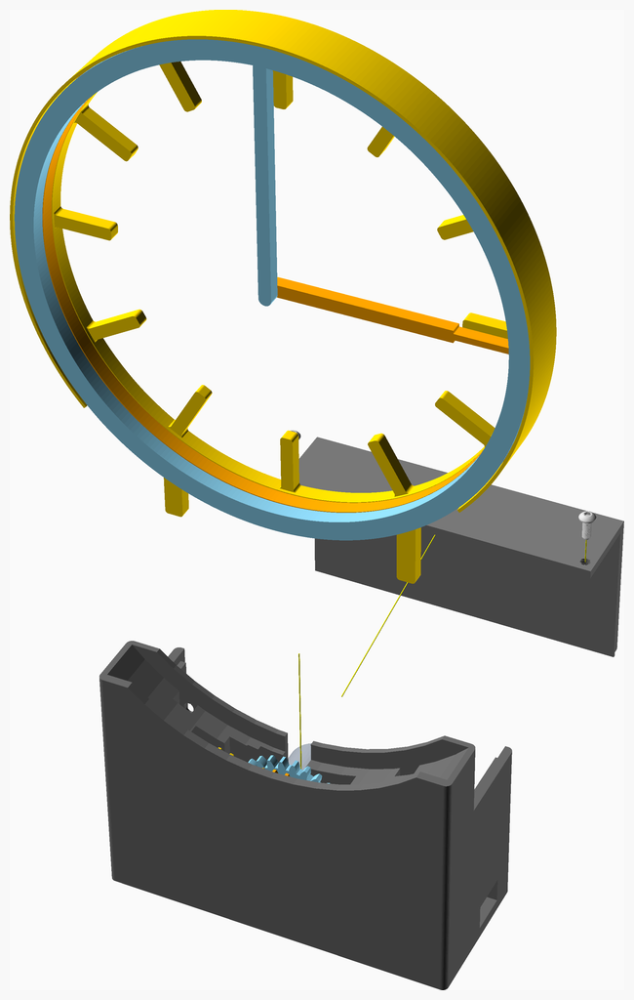

# HollowClock
# Hollow Clock Assembly Instructions

---

## Table of Contents

1. [Parts list](#Parts_list)

1. [Clock Face Assembly](#Clock_Face_assembly)
1. [Gears Assembly](#Gears_assembly)
1. [Base Stage 1 Assembly](#Base_Stage_1_assembly)
1. [Base Assembly](#Base_assembly)
1. [Main Assembly](#main_assembly)

[Top](#TOP)

---

## Parts list

| Clock Face | Gears | Base | Main | TOTALS |  |
|---:|---:|---:|---:|---:|:---|
|  |  |  |  | | **Vitamins** |
| &nbsp;&nbsp;.&nbsp; | &nbsp;&nbsp;.&nbsp; | &nbsp;&nbsp;4&nbsp; | &nbsp;&nbsp;.&nbsp; |  &nbsp;&nbsp;4&nbsp; | &nbsp;&nbsp; Bolt M2 caphead x  6mm |
| &nbsp;&nbsp;.&nbsp; | &nbsp;&nbsp;.&nbsp; | &nbsp;&nbsp;2&nbsp; | &nbsp;&nbsp;.&nbsp; |  &nbsp;&nbsp;2&nbsp; | &nbsp;&nbsp; Bolt M3 buttonhead x  6mm |
| &nbsp;&nbsp;.&nbsp; | &nbsp;&nbsp;.&nbsp; | &nbsp;&nbsp;3&nbsp; | &nbsp;&nbsp;2&nbsp; |  &nbsp;&nbsp;5&nbsp; | &nbsp;&nbsp; Bolt M3 buttonhead x  8mm |
| &nbsp;&nbsp;.&nbsp; | &nbsp;&nbsp;.&nbsp; | &nbsp;&nbsp;1&nbsp; | &nbsp;&nbsp;.&nbsp; |  &nbsp;&nbsp;1&nbsp; | &nbsp;&nbsp; Bolt M3 caphead x 16mm |
| &nbsp;&nbsp;.&nbsp; | &nbsp;&nbsp;1&nbsp; | &nbsp;&nbsp;.&nbsp; | &nbsp;&nbsp;.&nbsp; |  &nbsp;&nbsp;1&nbsp; | &nbsp;&nbsp; Geared stepper - 28BYJ-48 5V |
| &nbsp;&nbsp;.&nbsp; | &nbsp;&nbsp;.&nbsp; | &nbsp;&nbsp;1&nbsp; | &nbsp;&nbsp;.&nbsp; |  &nbsp;&nbsp;1&nbsp; | &nbsp;&nbsp; Raspberry Pi Pico |
| &nbsp;&nbsp;.&nbsp; | &nbsp;&nbsp;.&nbsp; | &nbsp;&nbsp;1&nbsp; | &nbsp;&nbsp;.&nbsp; |  &nbsp;&nbsp;1&nbsp; | &nbsp;&nbsp; ZC-A0591 ULN2003 driver PCB |
| &nbsp;&nbsp;.&nbsp; | &nbsp;&nbsp;1&nbsp; | &nbsp;&nbsp;12&nbsp; | &nbsp;&nbsp;2&nbsp; | &nbsp;&nbsp;15&nbsp; | &nbsp;&nbsp;Total vitamins count |
|  |  |  |  | | **3D printed parts** |
| &nbsp;&nbsp;.&nbsp; | &nbsp;&nbsp;.&nbsp; | &nbsp;&nbsp;1&nbsp; | &nbsp;&nbsp;.&nbsp; |  &nbsp;&nbsp;1&nbsp; | &nbsp;&nbsp;Base.stl |
| &nbsp;&nbsp;1&nbsp; | &nbsp;&nbsp;.&nbsp; | &nbsp;&nbsp;.&nbsp; | &nbsp;&nbsp;.&nbsp; |  &nbsp;&nbsp;1&nbsp; | &nbsp;&nbsp;Clock_Face.stl |
| &nbsp;&nbsp;.&nbsp; | &nbsp;&nbsp;.&nbsp; | &nbsp;&nbsp;.&nbsp; | &nbsp;&nbsp;1&nbsp; |  &nbsp;&nbsp;1&nbsp; | &nbsp;&nbsp;Cover.stl |
| &nbsp;&nbsp;.&nbsp; | &nbsp;&nbsp;1&nbsp; | &nbsp;&nbsp;.&nbsp; | &nbsp;&nbsp;.&nbsp; |  &nbsp;&nbsp;1&nbsp; | &nbsp;&nbsp;Drive_Gear.stl |
| &nbsp;&nbsp;.&nbsp; | &nbsp;&nbsp;1&nbsp; | &nbsp;&nbsp;.&nbsp; | &nbsp;&nbsp;.&nbsp; |  &nbsp;&nbsp;1&nbsp; | &nbsp;&nbsp;Hour_Gear.stl |
| &nbsp;&nbsp;1&nbsp; | &nbsp;&nbsp;.&nbsp; | &nbsp;&nbsp;.&nbsp; | &nbsp;&nbsp;.&nbsp; |  &nbsp;&nbsp;1&nbsp; | &nbsp;&nbsp;Hour_Hand.stl |
| &nbsp;&nbsp;1&nbsp; | &nbsp;&nbsp;.&nbsp; | &nbsp;&nbsp;.&nbsp; | &nbsp;&nbsp;.&nbsp; |  &nbsp;&nbsp;1&nbsp; | &nbsp;&nbsp;Minute_Hand.stl |
| &nbsp;&nbsp;.&nbsp; | &nbsp;&nbsp;.&nbsp; | &nbsp;&nbsp;1&nbsp; | &nbsp;&nbsp;.&nbsp; |  &nbsp;&nbsp;1&nbsp; | &nbsp;&nbsp;Reduction_Gear.stl |
| &nbsp;&nbsp;3&nbsp; | &nbsp;&nbsp;2&nbsp; | &nbsp;&nbsp;2&nbsp; | &nbsp;&nbsp;1&nbsp; | &nbsp;&nbsp;8&nbsp; | &nbsp;&nbsp;Total 3D printed parts count |

[Top](#TOP)

---

## Clock Face Assembly

### 3D Printed parts

| 1 x Clock_Face.stl | 1 x Hour_Hand.stl | 1 x Minute_Hand.stl |
|---|---|---|
|  |  |  

### Assembly instructions

[Top](#TOP)

---

## Gears Assembly

### Vitamins

|Qty|Description|
|---:|:----------|
|1| Geared stepper - 28BYJ-48 5V|

### 3D Printed parts

| 1 x Drive_Gear.stl | 1 x Hour_Gear.stl |
|---|---|
|  |  

### Assembly instructions

[Top](#TOP)

---

## Base Stage 1 Assembly

### Vitamins

|Qty|Description|
|---:|:----------|
|4| Bolt M2 caphead x  6mm|
|3| Bolt M3 buttonhead x  8mm|
|1| Bolt M3 caphead x 16mm|
|1| Raspberry Pi Pico|
|1| ZC-A0591 ULN2003 driver PCB|

### 3D Printed parts

| 1 x Base.stl | 1 x Reduction_Gear.stl |
|---|---|
|  |  

### Assembly instructions

Wiring is easier if the stepper driver pcb is mounted "upside down" and attached with just 3 screws.

[Top](#TOP)

---

## Base Assembly

### Vitamins

|Qty|Description|
|---:|:----------|
|2| Bolt M3 buttonhead x  6mm|

### Sub-assemblies

| 1 x Base_Stage_1_assembly | 1 x Gears_assembly |
|---|---|
|  |  

### Assembly instructions

[Top](#TOP)

---

## Main Assembly

### Vitamins

|Qty|Description|
|---:|:----------|
|2| Bolt M3 buttonhead x  8mm|

### 3D Printed parts

| 1 x Cover.stl |
|---|
|  

### Sub-assemblies

| 1 x Base_assembly | 1 x Clock_Face_assembly |
|---|---|
|  |  

### Assembly instructions

[Top](#TOP)
