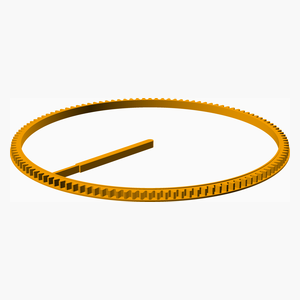
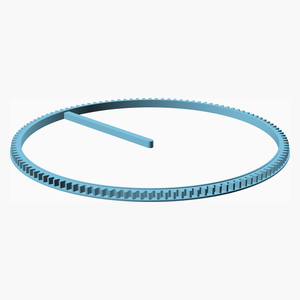
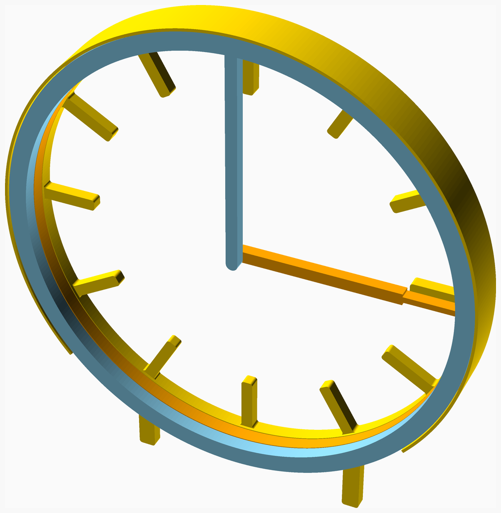
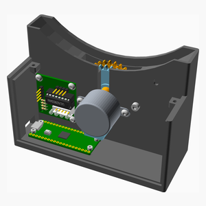

# Hollow Clock Assembly Instructions

---

## Table of Contents

1. [Parts list](#Parts_list)

1. [Clock_Face assembly](#Clock_Face_assembly)
1. [Gears assembly](#Gears_assembly)
1. [Base_Stage_1 assembly](#Base_Stage_1_assembly)
1. [Base assembly](#Base_assembly)
1. [Main assembly](#main_assembly)

[Top](#TOP)

---

## Parts list

| Clock Face | Gears | Base | Main | TOTALS |  |
|-----:|-----:|-----:|-----:|------:|:---|
|      |      |      |      |       | **Vitamins** |
|   .  |   .  |   4  |   .  |    4  |  Bolt M2 caphead x  6mm |
|   .  |   .  |   2  |   .  |    2  |  Bolt M3 buttonhead x  6mm |
|   .  |   .  |   4  |   2  |    6  |  Bolt M3 buttonhead x  8mm |
|   .  |   .  |   1  |   .  |    1  |  Bolt M3 caphead x 16mm |
|   .  |   1  |   .  |   .  |    1  |  Geared stepper - 28BYJ-48 5V |
|   .  |   .  |   1  |   .  |    1  |  Raspberry Pi Pico |
|   .  |   .  |   1  |   .  |    1  |  ZC-A0591 ULN2003 driver PCB |
|   .  |   1  |  13  |   2  |   16  | Total vitamins count |
|      |      |      |      |       | **3D printed parts** |
|   .  |   .  |   1  |   .  |    1  | Base.stl |
|   1  |   .  |   .  |   .  |    1  | Clock_Face.stl |
|   .  |   .  |   .  |   1  |    1  | Cover.stl |
|   .  |   1  |   .  |   .  |    1  | Drive_Gear.stl |
|   .  |   1  |   .  |   .  |    1  | Hour_Gear.stl |
|   1  |   .  |   .  |   .  |    1  | Hour_Hand.stl |
|   1  |   .  |   .  |   .  |    1  | Minute_Hand.stl |
|   .  |   .  |   1  |   .  |    1  | Reduction_Gear.stl |
|   3  |   2  |   2  |   1  |    8  | Total 3D printed parts count |

[Top](#TOP)

---

## Clock_Face assembly

### 3D Printed parts

| 1 x Clock_Face.stl | 1 x Hour_Hand.stl | 1 x Minute_Hand.stl |
|---|---|---|
|  |  |  

### Assembly instructions

[Top](#TOP)

---

## Gears assembly

### Vitamins

|Qty|Description|
|---:|:----------|
|1| Geared stepper - 28BYJ-48 5V|

### 3D Printed parts

| 1 x Drive_Gear.stl | 1 x Hour_Gear.stl |
|---|---|
|  |  

### Assembly instructions

[Top](#TOP)

---

## Base_Stage_1 assembly

### Vitamins

|Qty|Description|
|---:|:----------|
|4| Bolt M2 caphead x  6mm|
|4| Bolt M3 buttonhead x  8mm|
|1| Bolt M3 caphead x 16mm|
|1| Raspberry Pi Pico|
|1| ZC-A0591 ULN2003 driver PCB|

### 3D Printed parts

| 1 x Base.stl | 1 x Reduction_Gear.stl |
|---|---|
|  |  

### Assembly instructions

[Top](#TOP)

---

## Base assembly

### Vitamins

|Qty|Description|
|---:|:----------|
|2| Bolt M3 buttonhead x  6mm|

### Sub-assemblies

| 1 x Base_Stage_1_assembly | 1 x Gears_assembly |
|---|---|
|  |  

### Assembly instructions

[Top](#TOP)

---

## main assembly

### Vitamins

|Qty|Description|
|---:|:----------|
|2| Bolt M3 buttonhead x  8mm|

### 3D Printed parts

| 1 x Cover.stl |
|---|
|  

### Sub-assemblies

| 1 x Base_assembly | 1 x Clock_Face_assembly |
|---|---|
|  |  

### Assembly instructions

[Top](#TOP)
